# Burak
Burak is PWA B2B ecommerce marketplace that helps mom-and-pop stores source inventory and manage their debit and credits

## About the Project
I started to build this mvp for my startup then did not even launched it because it required a large capital for even starting. But i learnt a lot of stuff from this app. It really helped me to learn Django more in detail. 
For easier use of local i built this in Urdu. It is not complete. It was Just an MVP
## Fun Fact
Startups with products like this app are now funded (largest series A in history of startups in pakistan 30 million dollars)
I did not even tried to develop it further :(
## Setup
	Phone = 03123456789
	Pass  = 1234
	With Docker 
		docker build -t burak -f Dockerfile .
		docker run -ti -p 8000:8000 burak
	Without Docker 
		pipenv shell
		pip3 install -r requirements.txt
		activate enviroment
		python manage.py runserver
	open 127.0.0.1:8000 or localhost:8000

## ScreenShots

1. Home page for Shops 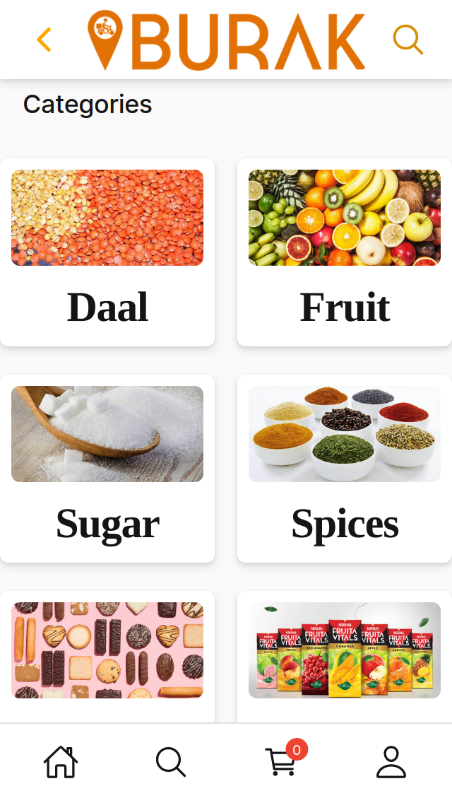
2. Home Page Dark Mode :) 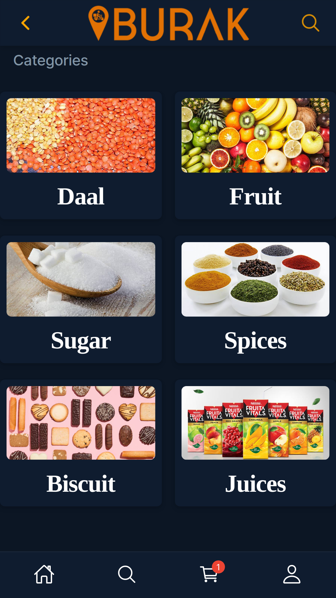
3. Add to Cart 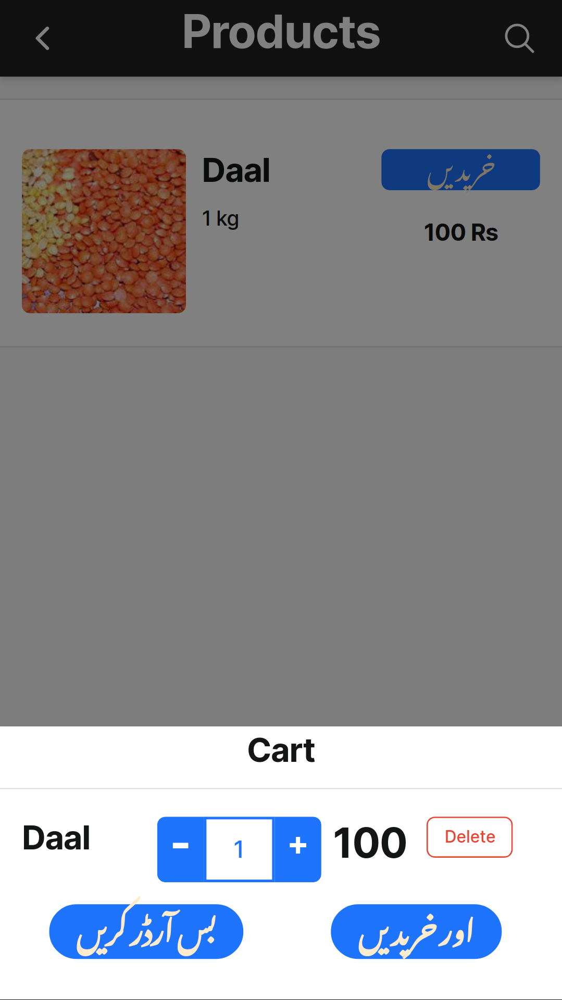
4. Cart 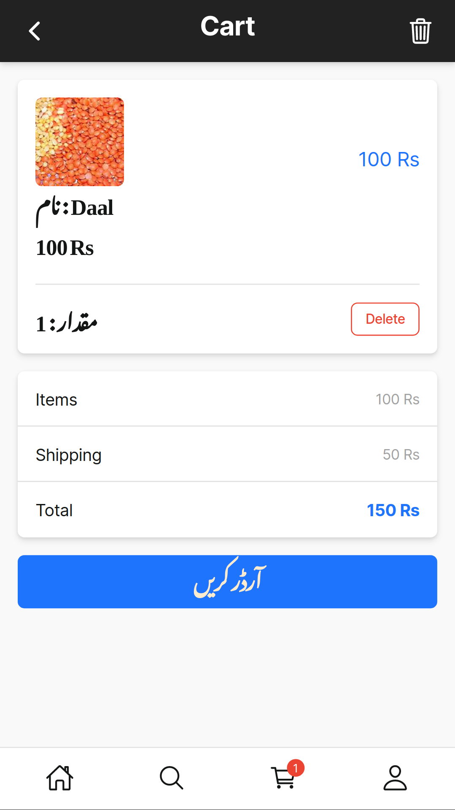
5. Cart Delete 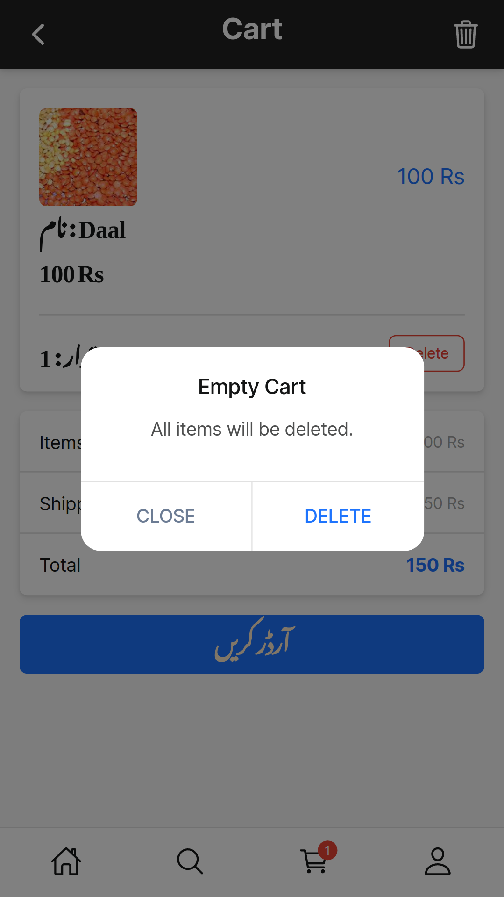
6. Dukan view of summary of purchasing and credits given 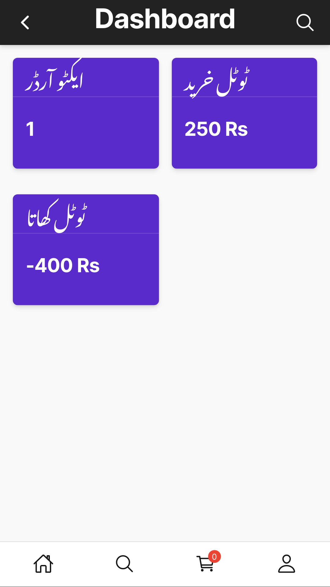
7. Detail view of customer credits and debits 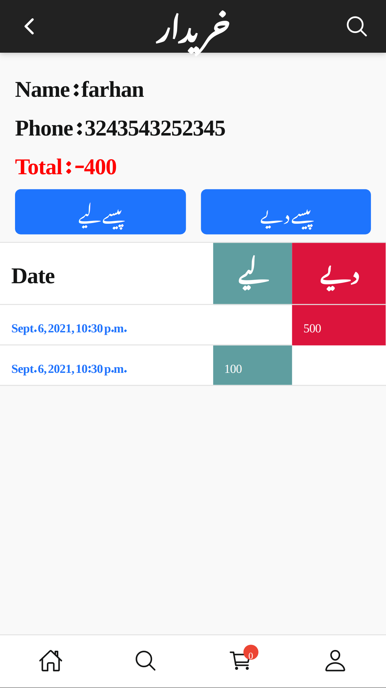
8. Summary of customers credits and debits 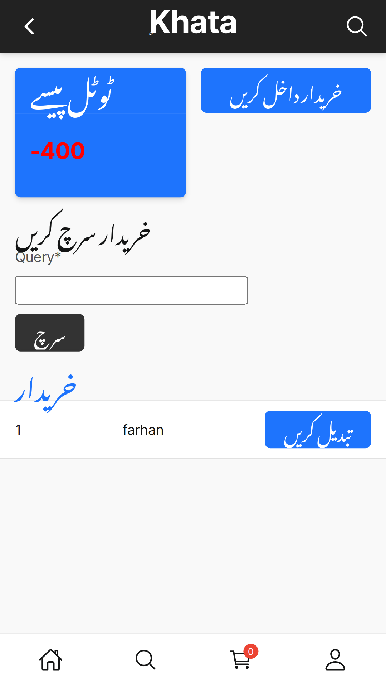
9. Search Page 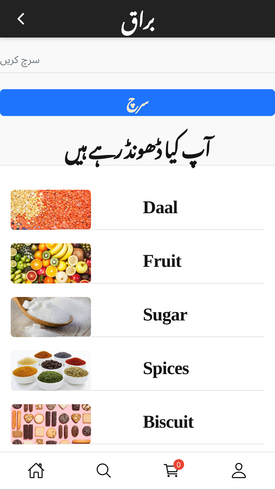
10.Search Result 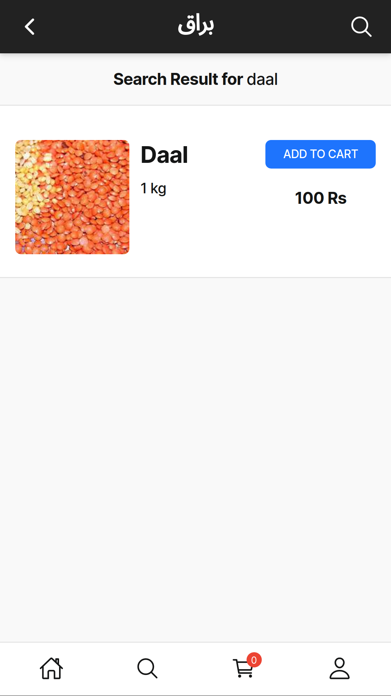
11.Order Detail 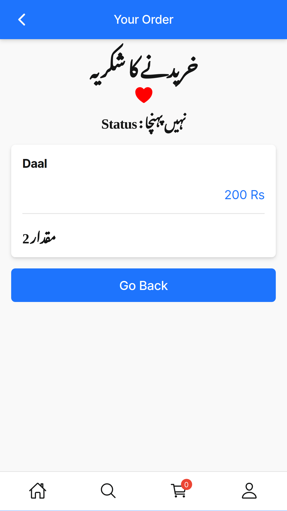
<b> With Docker </b> 
open folder then run

docker build -t burak -f Dockerfile .

docker run -ti -p 8000:8000 burak

<b> Without Docker </b>
pipenv shell
pip3 install -r requirements.txt
activate enviroment
python manage.py runserver
## ScreenShots
  1. Home page for Shops 
  2. Home Page Dark Mode :) 
  3. Add to Cart 
  4. Cart 
  5. Cart Delete 
  6. Dukan view of summary of purchasing and credits given 
  7. Detail view of customer credits and debits 
  8. Summary of customers credits and debits 
  9. Search Page 
  10.Search Result 
  11.Order Detail S

